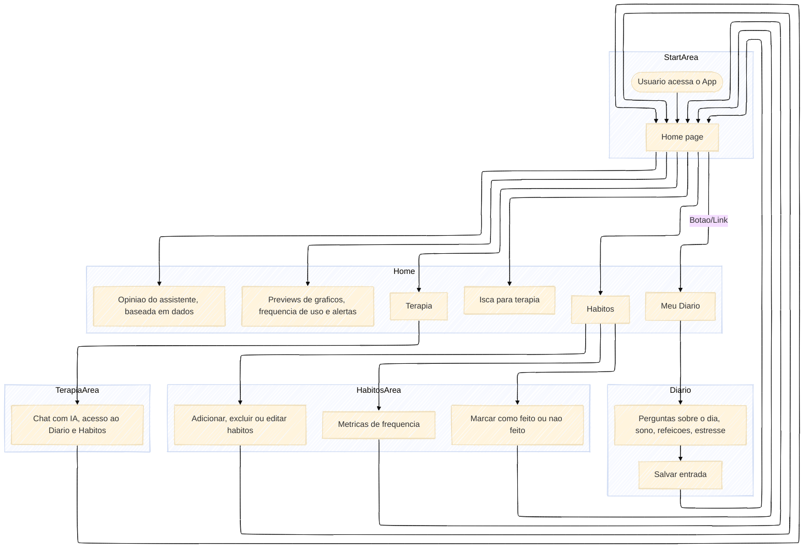

# ai-habit-journal
Eu sou o AI Habit Journal, seu espaço para reclamar do dia, tentar organizar sua vida e fingir que está tudo sob controle. Vou te ajudar a construir hábitos que prestem, largar os que só te atrasam (sim, aquele mesmo), e ainda esfregar gráficos na sua cara pra provar que você tá melhorando... ou não. 😏

## Estamos trabalhando arduamente... mas não crie muitas expectativas

Olha, se você está esperando esse projeto ficar pronto pra finalmente dar um jeito nessa sua vida desorganizada... **não faça isso**. Sério, se sua vida tá uma bagunça, **não vai ser esse projeto que vai consertar tudo**. (Brincadeira... 🙃)

Enquanto isso, dá só uma olhada no que meu criador está preparando para mim com esse ***diagrama***. 
Pode até parecer promissor — ou vai ser só mais um projeto nunca mais terminado. 😬

---

# Diagrama de Fluxo de Usuário

