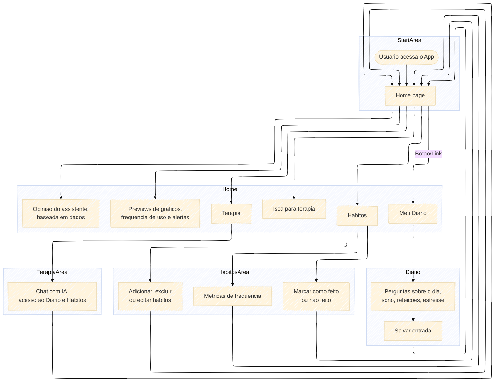

# Diagrama de Fluxo de Usuário

```mermaid
---
config:
  theme: base
  layout: elk
  look: handDrawn
---
flowchart TB
 subgraph StartArea["StartArea"]
    direction TB
        A(["Usuario acessa o App"])
        H["Home page"]
  end
 subgraph Home["Home"]
    direction TB
        HI["Previews de graficos,\nfrequencia de uso e alertas"]
        HA["Opiniao do assistente,\nbaseada em dados"]
        HT["Isca para terapia"]
        D["Meu Diario"]
        Habs["Habitos"]
        T["Terapia"]
  end
 subgraph Diario["Diario"]
    direction TB
        DQ["Perguntas sobre o dia,\nsono, refeicoes, estresse"]
        DS["Salvar entrada"]
  end
 subgraph HabitosArea["HabitosArea"]
    direction TB
        HM["Metricas de frequencia"]
        HA2["Adicionar, excluir\nou editar habitos"]
        HF["Marcar como feito\nou nao feito"]
  end
 subgraph TerapiaArea["TerapiaArea"]
    direction TB
        TC["Chat com IA,\nacesso ao Diario e Habitos"]
  end
    A --> H
    H --> HI & HA & HT & Habs & T
    H -- Botao/Link --> D
    D --> DQ
    DQ --> DS
    DS --> H
    Habs --> HM & HA2 & HF
    HM --> H
    HA2 --> H
    HF --> H
    T --> TC
    TC --> H

```